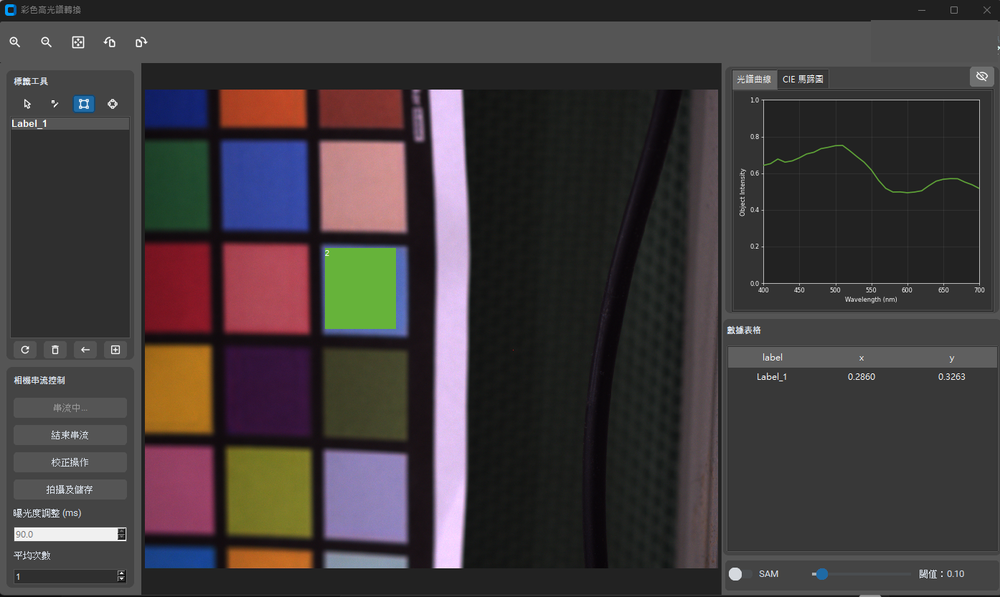
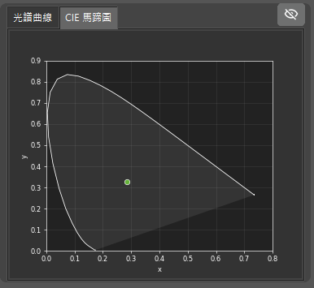
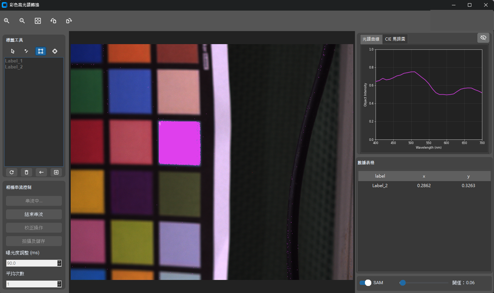

# 即時 RGB 轉高光譜取像與標註分析系統

本 repository 為產學合作專案的公開作品集版本，整理系統架構、功能展示與技術實作重點。完整原始碼、模型權重、實驗資料與合作方資訊因保密限制不公開。

本產學合作的核心工作包含 RGB-to-Hyperspectral 模型開發與光譜轉換能力驗證。為了讓模型成果能被實際展示、測試並銜接客戶端操作情境，進一步設計此即時取像與分析介面，將模型推論、工業相機串流、影像校正、ROI 標註與視覺化分析整合成一套可操作的桌面系統。系統可將一般 RGB 影像轉換為 400-700 nm、31 波段的高光譜資料，並提供光譜曲線、CIE 1931 色度座標與 Spectral Angle Mapper (SAM) 即時分析。

## 專案定位

- 類型：科研儀器介面、影像處理系統、AI 模型部署、光譜分析工具
- 背景：產學合作主要進行 RGB-to-Hyperspectral 模型開發，介面系統用於模型展示、驗證與客戶端操作情境銜接
- 場景：工業相機即時取像後，進行校正、標註、RGB-to-Hyperspectral 推論與分析
- 目標：將模型推論能力包裝成可操作的取像分析流程，讓使用者能在同一套介面完成取像、校正、ROI 標註、光譜分析與資料匯出
- 公開範圍：系統說明、去識別化截圖、架構與技術重點

## 專案亮點

- 建立完整的高光譜取像流程，包含相機串流、曝光控制、黑白校正、平場校正、影像擷取與資料匯出。
- 將 PyTorch 模型整合進桌面應用，支援 RGB 影像即時轉換為 31 波段高光譜資料立方體。
- 將模型開發成果轉化為可展示、可測試、可交付討論的客戶端操作介面，降低模型驗證與成果展示門檻。
- 支援物體色、光源色與偏振影像三種校正/轉換模式，可依不同場景快速切換模型權重。
- 開發互動式 ROI 標註工具，支援點、矩形與圓形 ROI，並即時計算各標籤的平均光譜。
- 建立即時分析視覺化，包含光譜曲線、多標籤比較、CIE 1931 色度圖與 SAM 相似度遮罩。
- 使用 GPU 加速校正與矩陣運算，降低即時取像、推論與分析流程的延遲。

## 介面展示

以下截圖已移除合作單位識別資訊，僅展示系統功能與介面流程。

### ROI 標註與即時光譜分析



主介面將標註工具、相機控制、即時影像、光譜曲線與 CIE xy 座標整合在同一個操作畫面。使用者標註 ROI 後，系統會即時計算該區域的平均光譜，並更新右側分析圖表。


### CIE 1931 色度分析



系統會將預測光譜轉換為 CIE 1931 xy 色度座標，協助檢查色彩與光譜轉換結果的一致性。

### SAM 光譜相似度遮罩



啟用 SAM 後，系統會根據已標註 ROI 的參考光譜，計算影像中其他像素的光譜相似度，並以遮罩方式疊加顯示相似區域。


## 使用技術

| 類別 | 技術 |
| --- | --- |
| 程式語言 | Python |
| 桌面介面 | tkinter, customtkinter, ttkbootstrap |
| 相機控制 | gxipy |
| 影像處理 | NumPy, OpenCV, Pillow |
| GPU 加速 | CuPy, CUDA |
| 深度學習 | PyTorch, TorchScript |
| 資料視覺化 | Matplotlib, colour-science |
| 高光譜資料格式 | spectral, ENVI `.hdr/.raw` |

## 系統架構

```text
工業相機
   |
   v
gxipy 相機取像執行緒
   |
   +--> Bayer / 偏振 mosaic 影像解碼
   |
   +--> GPU 影像校正
   |       - 物體色校正
   |       - 光源平場校正
   |       - 偏振四通道校正
   |
   v
RGB / 校正後影像串流
   |
   +--> GUI 影像顯示與 ROI 標註
   |
   +--> PyTorch RGB-to-HSI 模型推論
           |
           v
      31 波段高光譜資料立方體
           |
           +--> 光譜曲線
           +--> CIE 1931 xy 色度座標
           +--> SAM 相似度遮罩
           +--> ENVI .hdr/.raw 匯出
```

## 核心功能

### 1. 即時相機取像

- 透過 `gxipy` 偵測並連接工業相機。
- 即時擷取 Bayer raw frame，並轉換為 RGB 影像顯示於介面。
- 支援曝光值調整與過曝警示遮罩，協助使用者在校正前確認取像品質。
- 處理相機啟動、斷線、資源釋放與 UI 狀態同步。

### 2. 影像校正流程

- 物體色校正：使用 `(target - black) / (white - black)` 進行黑白參考校正。
- 光源色校正：使用 `(target - black) * flat_ref`，並根據曝光時間進行正規化。
- 偏振校正：將 raw mosaic 拆成 0、45、90、135 度四個通道，並分別套用通道校正。
- 校正資料可由相機即時拍攝，也可從既有 BMP 校正檔載入。

### 3. RGB 轉高光譜推論

- 將 RGB pixel 或完整影像轉換為 400-700 nm、31 波段光譜資料。
- 支援多種模型架構：
  - 物體色模型：以 autoencoder 架構進行 RGB-to-HSI 轉換。
  - 光源色模型：以 1D spectral network 預測光源光譜。
  - 偏振物體色模型：以 learnable subspace network 處理偏振影像資料。
- 模型載入後使用 TorchScript trace 加速推論。
- 支援整張影像產生高光譜 cube，也支援 ROI 區域平均光譜估測。

### 4. ROI 標註與分析

- 提供點、矩形 ROI、圓形 ROI 三種標註工具。
- 支援多標籤管理，每個標籤可擁有獨立顏色與多個 ROI。
- 系統會從校正後影像擷取 ROI pixel，轉換為光譜向量後計算平均光譜。
- 支援快捷標註流程，提升實驗操作效率。

### 5. 光譜、色度與 SAM 視覺化

- 即時繪製多標籤光譜曲線，方便比較不同樣本或材質區域。
- 根據預測光譜計算 CIE 1931 xy 色度座標。
- 在 CIE 色度圖上顯示各標籤位置。
- 使用 Spectral Angle Mapper 比對像素光譜與 ROI 參考光譜，並將相似區域以 mask overlay 顯示。

## 技術實作重點

### 事件導向桌面架構

主程式負責協調 UI 元件、相機串流、標註事件、模型轉換與 SAM 狀態。系統將相機流程、畫布互動、分析面板與 UI 狀態管理拆成不同模組，降低耦合並提升維護性。

### 多執行緒即時取像

相機取像在背景執行緒中運作，避免阻塞 GUI。主介面定期取得最新 frame 更新畫面，校正影像與 raw frame 由相機執行緒管理，讓即時顯示與分析流程能同時進行。

### GPU 校正與模型推論

系統使用 CuPy 加速黑白校正、平場校正與過曝遮罩計算。PyTorch 模型載入後透過 TorchScript trace 轉為可重複使用的推論模型，支援 ROI pixel 推論與整張影像高光譜 cube 生成。

### ROI 到光譜分析流程

標註系統以影像座標儲存 ROI 幾何資訊。更新時從校正後 frame 擷取 ROI pixel，轉換成光譜向量後依標籤計算平均光譜，讓使用者能即時比較不同樣本或材質區域。

### 偏振影像支援

系統可將偏振 mosaic 影像拆成四個角度通道。每個角度通道可獨立校正、顯示與推論，並支援偏振 RGB-to-HSI 模型。

## 輸出資料

系統原始版本支援以下輸出格式：

- `.bmp`：raw 影像或校正後影像。
- `.hdr/.raw`：ENVI 格式高光譜資料 cube。
- `.npy`：校正因子或中間數值資料。
- `.log`：系統執行紀錄與錯誤日誌。

## 公開版本內容

此公開 repo 僅包含：

```text
.
├── README.md
└── docs/
    └── images/
        ├── main-ui-roi-spectrum.png
        ├── sam-overlay.png
        └── cie-chromaticity.png
```

此公開 repo 不包含：

- 原始碼
- 模型權重
- 訓練資料或實驗資料
- 相機 SDK 或設備資訊
- log、raw、hdr、npy 等輸出檔
- 合作單位名稱與內部文件

## 履歷精簡描述

- 參與 RGB-to-Hyperspectral 模型開發，並以 Python 建立即時高光譜取像桌面系統，將模型能力轉化為可展示與驗證的操作介面。
- 整合工業相機串流、GPU 校正與 PyTorch RGB-to-HSI 推論，支援模型於實際取像流程中的測試與分析。
- 開發 ROI 標註、光譜曲線、CIE 色度圖與 SAM 相似度遮罩功能，支援即時樣本分析與客戶端展示。
- 支援物體色、光源色與偏振影像三種流程，並可輸出 `.bmp`、ENVI `.hdr/.raw` 等實驗資料格式。

## 保密說明

本 repository 為產學合作專案的公開作品集版本，僅包含系統架構、功能展示與去識別化截圖。完整原始碼、模型權重與實驗資料因合作限制不公開。
